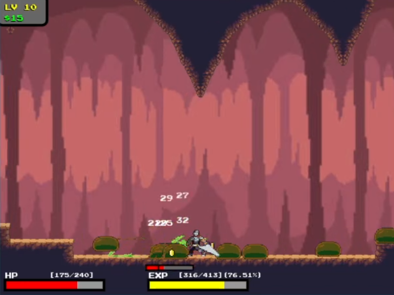
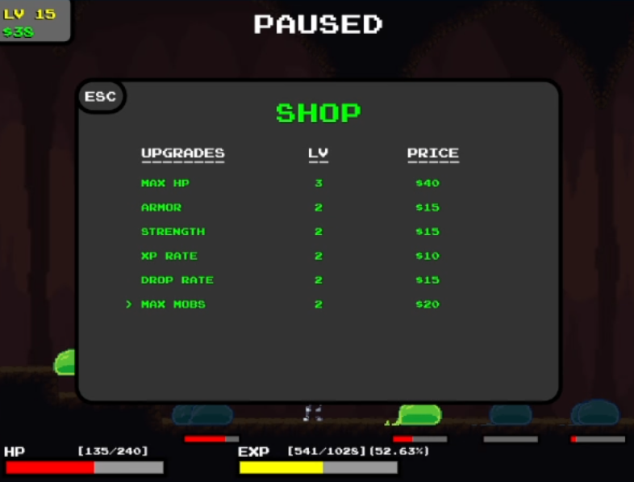
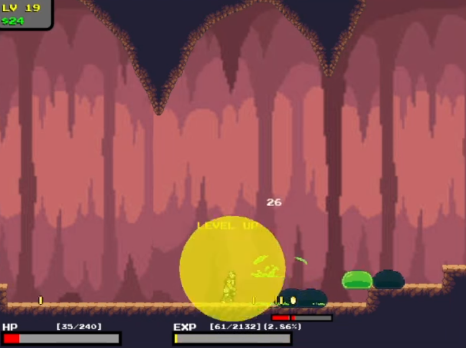

# Slimefall 

## Description
Slimefall is a 2D side-scrolling action RPG built in Lua with the LÖVE 2D framework.
Players battle waves of slime monsters, collect coins, and purchase upgrades to survive as long as possible.

This project was developed as my final project for Harvard’s CS50x, showcasing game mechanics such as combat, enemy AI, upgrades, and save/load progression.

Video Demo: [Watch on YouTube](https://youtu.be/RKlED6n1U-8)


## Features
- Player movement, combat, and jumping mechanics

- Enemy AI with collision and attack interactions

- Shop system for upgrades (strength, HP, damage reduction, coin drops, etc.)

- Save/load functionality with progression reset on game over

- Camera that follows the player across a tile-based map

- Background music and sound effects for immersive gameplay


# How to Play
**1.** Clone this repository:
```bash
git clone https://github.com/nathanjly/slime-attack.git
cd slime-attack
```

**2.** Install [LÖVE 2D](https://love2d.org/)

**3.** Run the game:
```bash
love .
```

## Controls
- **Left/Right Arrow Keys** → Move
- **Spacebar** → Jump
- **V** → Attack
- **Esc** → Pause/Shop/Save
- **Enter** → Confirm menu selections


# Screenshots

*Gameplay Demo*


*Combat*


*Upgrade stats in the shop*


*Gain experience and level up by defeating mobs*


# Technologies
- **Language**: Lua
- **Framework**: LÖVE 2D
- **Libraries**:
    - windfield → Physics
    - anim8 → Sprite animation
    - lume → Save serialization
    - hump.timer → Timed interactions
    - STI → Tiled map integration
- **Tools**: Tiled (map editor)


# Future Improvements
- Add critical strike mechanics
- Expand shop upgrades and item variety
- Multiple maps and quest system
- Additional item drops
- Sound/music settings
- Custom controls


# Author
**Nathan Ly**
- Github: github.com/nathanjly
- Email: nathanjly.njl@gmail.com
- Built as part of [CS50x (HarvardX)](https://cs50.harvard.edu/x/)